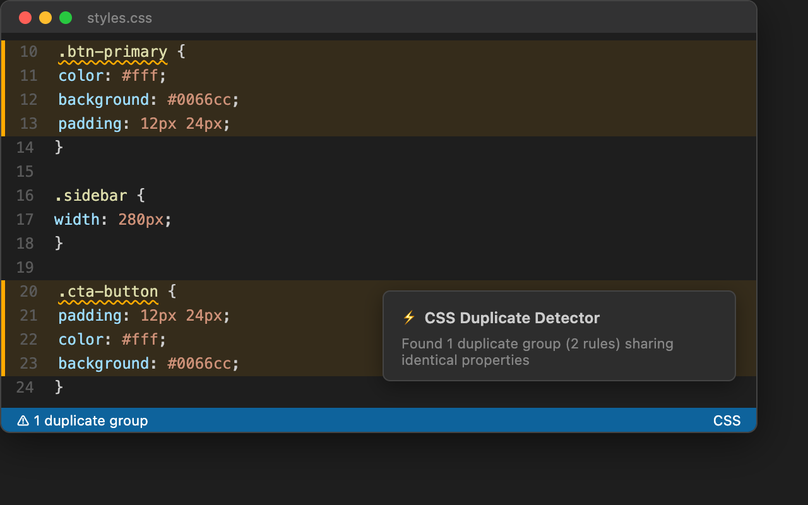
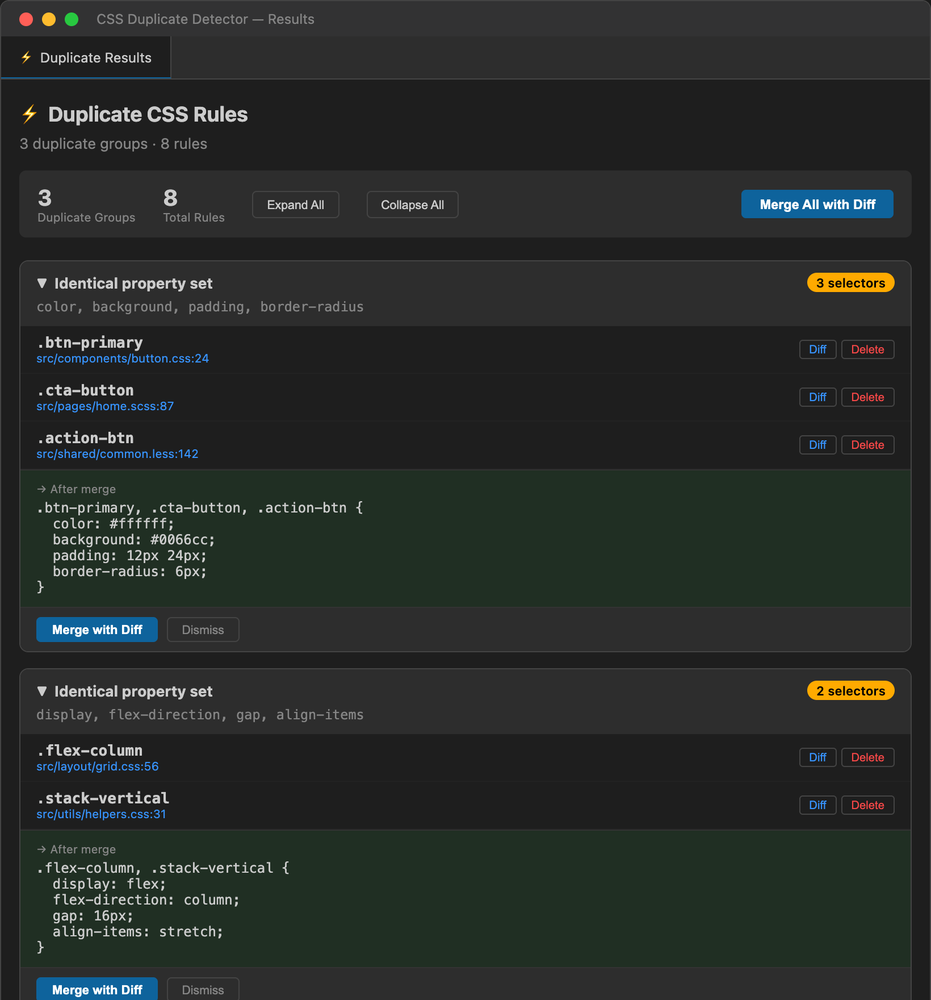
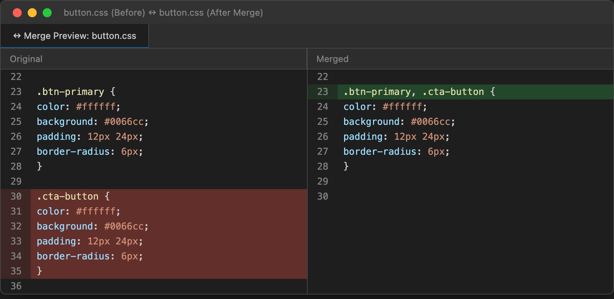
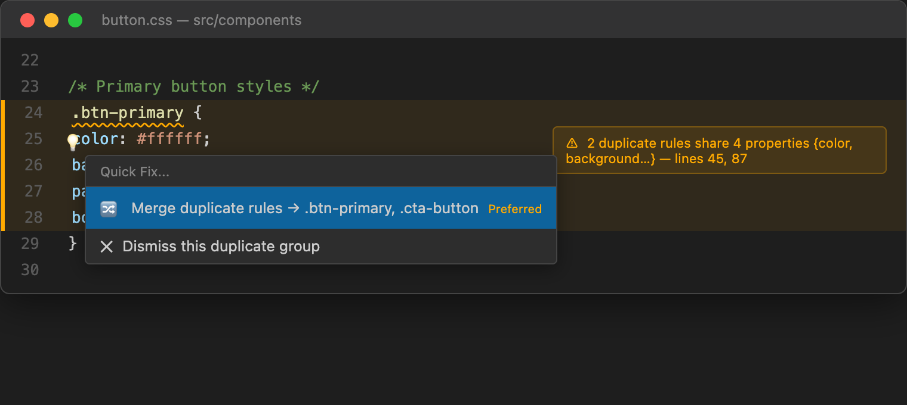
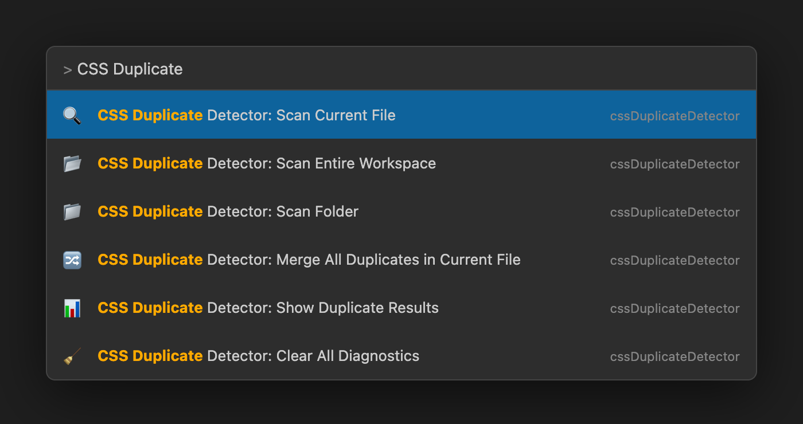

# CSS Duplicate Detector & Merger

> Finds CSS rules with identical property sets — regardless of selector name or declaration order — and lets you merge them safely with diff preview.



## Why This Extension?

Large stylesheets accumulate duplicate rules over time. `.btn-primary` and `.cta-button` might declare the exact same `color`, `background`, and `padding` — but no linter will catch that. This extension does.

Unlike selector-name matchers, **CSS Duplicate Detector** compares the full property signature of every rule, so it catches duplicates that other tools miss entirely.

## Features

### Semantic Property-Set Matching

Finds rules with **identical property sets** across your CSS, SCSS, and LESS files — order-insensitive.

```css
/* Detected as duplicates */
.card { padding: 16px; color: #333; }
.box  { color: #333; padding: 16px; }   /* same props, different order */

/* After merge → */
.card, .box { padding: 16px; color: #333; }
```

### Rich Results Panel

Collapsible group cards with per-rule **Diff** and **Delete** buttons, merge preview, and batch controls.



### Safe Merge with Diff Preview

Every merge and delete opens a **VS Code diff editor** first — review the exact changes before applying. Nothing is auto-applied.



### Quick Fix Integration

Lightbulb actions appear inline — merge a group or dismiss it directly from the editor.



### All Commands

Access all features from the Command Palette.



### Full LESS / SCSS Nesting Support

Recursive parser handles `&` parent references, deeply nested rules, and reports correct absolute line numbers.

### Workspace-Wide Scanning

- **Scan Current File** — single file analysis
- **Scan Workspace** — all CSS/SCSS/LESS files in your project
- **Scan Folder** — right-click any folder in the explorer

## Settings

| Setting | Description | Default |
|---------|-------------|---------|
| `enableInlineHints` | Show gutter markers on duplicate rules | `false` |
| `severityLevel` | Diagnostic severity: error, warning, info, hint, none | `hint` |
| `excludeExtensions` | Skip files by extension (e.g. `.min.css`) | `[]` |
| `excludeFiles` | Skip files by glob pattern (e.g. `**/vendor/**`) | `[]` |

## Context Menus

- **Editor** right-click → Scan Current File, Merge All Duplicates
- **Explorer** right-click on folder → Scan Folder, Scan Workspace

## Supported Languages

- CSS
- SCSS / Sass
- LESS

## Requirements

- VS Code 1.106.0 or later
- No additional dependencies required

## License

[MIT](LICENSE)


This project is developed independently during personal time 
and does not contain any proprietary or confidential code 
from my employer.
